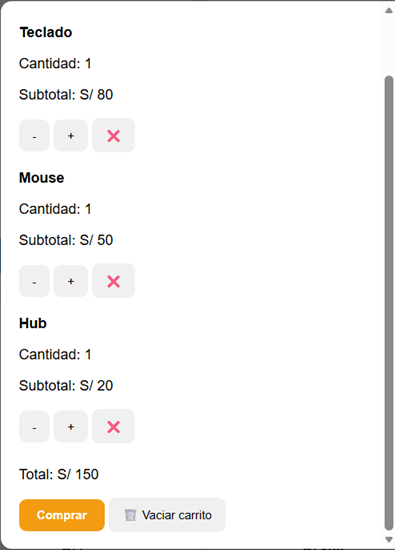
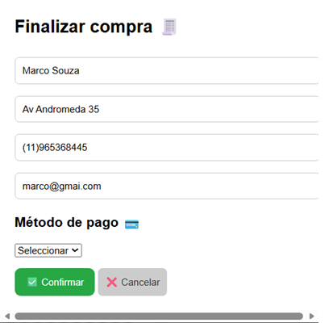
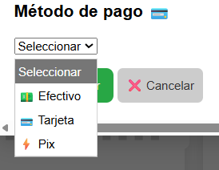
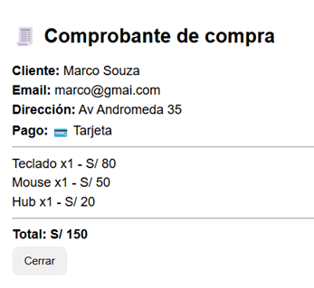
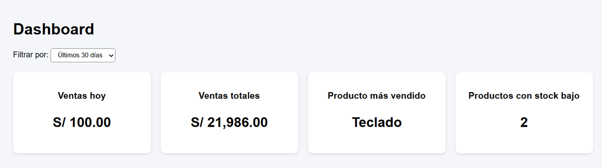
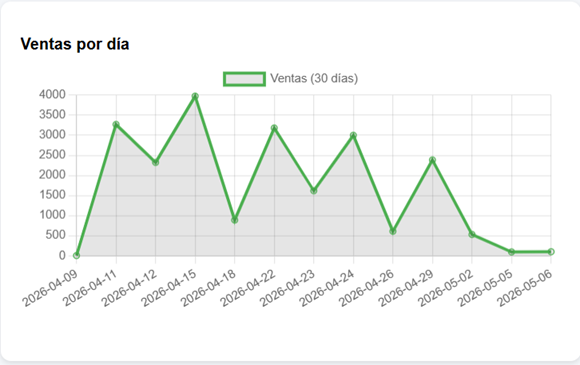
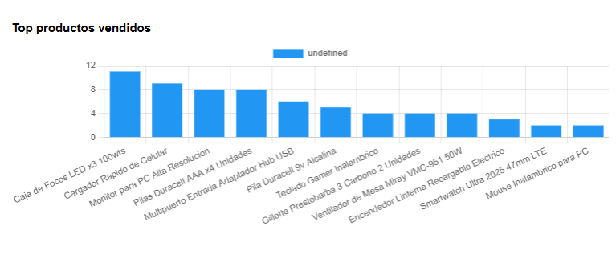
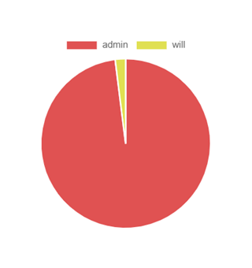

<Markdown>
# 🛒 TiendaVirtual Web
### Sistema Full Stack de E-commerce con Dashboard Administrativo

Sistema completo de tienda virtual con carrito de compras, autenticación JWT y panel administrativo con métricas en tiempo real.

---

## 🏠 Vista principal del sistema

---

## 🛍️ Flujo de compra

### 📦 Catálogo y carrito

---

### 🛒 Carrito de compras

---

### 💳 Checkout y pago

  
  

---

## 📊 Dashboard administrativo

Sistema de métricas en tiempo real:

---

### 📈 Ventas por día

---

### 🏆 Top productos

---

### 👤 Ventas por usuario

---

## ⚙️ Tecnologías utilizadas

### Backend
- Java 23
- Spring Boot 3.2.2
- Spring Security + JWT
- Maven
- MySQL

### Frontend
- HTML5
- CSS3
- JavaScript Vanilla

---

## 🛍️ Funcionalidades

- Catálogo de productos
- Carrito de compras dinámico
- Checkout con ticket
- Autenticación JWT
- Control de roles (ADMIN / USER)
- Dashboard administrativo
- Gestión de productos y usuarios

---

## ⏱️ Desarrollo

Proyecto desarrollado en aproximadamente 2 meses con apoyo de Inteligencia Artificial (ChatGPT) para optimización, depuración y mejora del sistema.

---

## 👨‍💻 Autor

Will Peru
